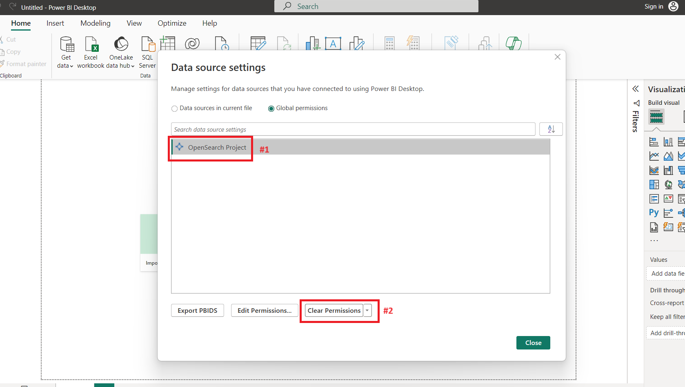

# Cheetah OpenSearch ODBC Driver

OpenSearchODBC is a read-only ODBC driver for Windows and Mac for connecting to OpenSearch SQL support that add Oauth authentication/authorization whithin JWToken. 
In this version the driver use the UI entry-point of the `BASIC` auth to allows to enter the JWT token in the `Password` field. The information in the field `User name` will be not used. 

## Specifications

The driver is compatible with ODBC 3.51.

## Supported Versions

  | Operating System  | Version                           | Supported Bitness |
  | ----------------- |-----------------------------------| ----------------- |
  |  Windows          |  Windows 10, Windows 11           | 32-bit, 64-bit    |
  |  MacOS            |  Catalina 10.15.4, Mojave 10.14.6 | 64-bit            |

## BI Tool Connectors

* [Power BI Desktop](bi-connectors/PowerBIConnector/README.md)

## Download and Installation the Baseline driver

Is advisable to start downloading the installers generated as part of the most recent release, for have a reference and a baseline.
They are available for download from [Artifacts page](https://opensearch.org/artifacts) on OpenSearch.org at the very bottom and from [automated CI workflow](https://github.com/opensearch-project/sql-odbc/actions/workflows/sql-odbc-main.yml).

### Windows

1. Run the `.msi` installer to install the OpenSearch SQL ODBC Driver.
2. [Test connection](docs/user/windows_configure_dsn.md) using ODBC Data Source Administrator.

To use the driver with Tableau:
1. Copy the `.tdc` file from `<driver-install-dir>/resources` to `<windows-user-dir>/Documents/My Tableau Repository/Datasources`.

This will customize the connection from Tableau to OpenSearch, ensuring that the correct forms of queries are used. 

### Mac

[iODBC Driver Manager](http://www.iodbc.org/dataspace/doc/iodbc/wiki/iodbcWiki/WelcomeVisitors) should be installed before installing the OpenSearch SQL ODBC Driver on Mac.

1. Run the `.pkg` installer to install the OpenSearch SQL ODBC Driver.
2. Configure a Driver and DSN entry for the OpenSearch SQL ODBC Driver, following the instructions [here](docs/user/mac_configure_dsn.md).

To use the driver with Tableau:
1. Copy the `.tdc` file from `<driver-install-dir>/resources` to `<mac-user-dir>/Documents/My Tableau Repository/Datasources`.

This will customize the connection from Tableau to OpenSearch, ensuring that the correct forms of queries are used.

## Customizing, developing and re-build, re-packaging manually the driver: Windows 
This option allows you to re-build and re-package the modified driver code advised if you don't have enough disk space or hardware resources.

### Set up development environment
1. In windows, install `vcpkg` (Package manager for C++) by cloning and follow the instruction from [Repo page](https://github.com/microsoft/vcpkg) but the installation path should be `c:\` (root) path. The reason of the the root path requirement is that a specific C++ package `aws-sdk-cpp` when installed from `vcpkg` doesn't work with a long installation-path. In case of different path make sure to modify the file `\scripts\build_windows_manual.ps1` in `$VCPKG_INSTALLED_DIR` variable and check for warnings/errors.
> [!IMPORTANT] 
> If is raised the warning "aws-sdk-cpp's buildsystem uses very long paths and may fail on your system" the installation path is too far way from the root and the installation is considered failed even though is a warning.
2. Install Visual Studio 2019 C++ Build Tools, but also can work with Visual Studio 2022.
3. For packaging is required to have `Wix < 4.0` (Windows installation creator) is possible to download the installer from [Wix page](https://wixtoolset.org/docs/wix3/) as `WiX Toolset build tools` or from this repository in `util-files` as `wix314.exe`.
4. In case of error during the packaging (especially in the case of Visual Studio 2019), download the binary builds from [Curl page](https://curl.se/windows/) and copy the `libcurl.dll` or from this repository in `util-files`, that will be required in the packaging phase.
5. Follow the instruction from the Readme file in [PowerBi](bi-connectors/PowerBIConnector/README.md), *.mez file required can be copied from the same folder or from the link descripted.

### Build with CMake
For build the project after the development is only needed to run a shell script that run automatically all the CMake files in the whole project in the `src` folder depending on the OS type and architecture: `build_[mac | win]_release[32 | 64]manual.[sh | ps1]`. This will produce in output the file `sqlodbc.dll` that contains the main logic. At the end of the building phase a folder should be created as `build` that contains all the dll's, CMake files and `*.vcxproj` scripts for packaging.

### Package
1. Copy and paste the `libcurl.dll` file in the folder `build\odbc\bin\Release` created in the build phase.
2. The packaging phase is made by a command from the root folder project: `msbuild .\build\odbc\cmake\PACKAGE.vcxproj -p:Configuration=Release`, at the end should produce a file in this location `build\odbc\cmake\OpenSearch SQL ODBC Driver <OS architecture>-bit-<version>-<OS type>.msi`

## Customizing, developing and re-build, re-packaging without local development environment with docker: Windows
This option allows you to re-build and re-package the modified driver code without installing any of the previous tools or taking multiple actions, but will take some 2-3 hours to build the image. Also, the image saved as Windows native will be around 22GB big. Of course, with a saved image and using caching the deployment time will be drastically shortened to less than 5 min for building and packaging.
> [!IMPORTANT]
> The image is Windows-based. Check for make sure Docker is configured to run Windows containers as describede here: [Run yout first windows container](https://learn.microsoft.com/en-us/virtualization/windowscontainers/quick-start/run-your-first-container).  

> [!IMPORTANT]
> Even though the image after a successful building will be around 22GB, it requires at least 35-40 GB in order to accomplish intermediate passage (especially installing modules with `vcpkg`). The error shown by the lack of memory space can be generalistic and not really pointed.

1. The build command `docker build --pull --rm -f "DockerfileWin" -t cheetahodbcwin:latest "." --build-arg ARCH=[32 | 64]` of the Dockerfile `DockerfileWin` will create the image named `cheetahodbcwin:latest` using the architecture of the host inserting `32` or `64` in the `ARCH` argument. The image is build to preserve the staticity of the dev environment, but with modifying the code of `src` or other side files will invalidate the cache and so a new build and packaging of it is triggered. The image will save the `.msi` file in `c:\odbcdriver\build\odbc\cmake\` folder. 
2. After successfully build an image, the command `docker run -v <destination_localhost_path>:<source_path> cheetahodbcwin:latest` will move the saved output `.msi` file in `<source_path> = c:\output` and then will be available at `<destination_localhost_path>` as the preferred local folder path.
3. Follow the instruction from the Readme file in [PowerBi](bi-connectors/PowerBIConnector/README.md), *.mez file required can be copied from the same folder or from the link described.

## The high level structure and relationships
In order to customize the driver two areas has to be taken in consideration. To have a quick reference, some indication about the UI of the driver is managed or declaring resources mainly from a Microsoft Visual C++ file `opensearch_odbc.rc`, and C programming such as `dlg_specific.h`, `dlg_wingui.c`, `setup.c`, `resource.h`. Instead the backend authentication is managed from C++ files such as `opensearch_communication.cpp`.

## Using the Driver
The driver comes in the form of a library file:
* Windows: `sqlodbc.dll`
* Mac: `libsqlodbc.dylib`

If using with ODBC compatible BI tools, refer to the tool documentation on configuring a new ODBC driver. In most cases, you will need to make the tool aware of the location of the driver library file and then use it to setup OpenSearch database connections. Should be enough for change the logic to substitute this dll `sqlodbc.dll` inside the opensearch installation path, but it was encounter some not so well specified error with this practice, so it is advisable to package and re-install from the produced `.msi` file.

## Using the Driver in PowerBI
1. For avoiding authenticate with another previous session that not bypass inserting any password or username or before testing is advisable to delete cached permission in `File -> Options and settings -> Data source settings` and then: . 
2. Use the connector for interact with the Opensearch database from the clipboard `Get data`: 

### Connection Strings and Configuring the Driver

A list of options available for configuring driver behaviour is available [here](docs/user/configuration_options.md).

To setup a connection, the driver uses an ODBC connection string. Connection strings are semicolon-delimited strings specifying the set of options to use for a connection. Typically, a connection string will either:

1. specify a Data Source Name containing a pre-configured set of options (`DSN=xxx;User=xxx;Password=xxx;`)
2. or configure options explicitly using the string (`Host=xxx;Port=xxx;LogLevel=OPENSEARCH_DEBUG;...`)

### Testing

**NOTE**: Some tests in ITODBCConnection will fail if a test DSN (Data Source Name) is not configured on your system. Refer to "Running Tests" in the [build instructions](docs/dev/BUILD_INSTRUCTIONS.md) for more information on configuring this.

## Documentation

Please refer to the [documentation](https://opensearch.org/docs/latest/) for detailed information on installing and configuring OpenSearch.

## Code of Conduct

This project has adopted an [Open Source Code of Conduct](CODE_OF_CONDUCT.md).

## Security issue notifications

If you discover a potential security issue in this project we ask that you notify AWS/Amazon Security via our [vulnerability reporting page](http://aws.amazon.com/security/vulnerability-reporting/). Please do **not** create a public GitHub issue.
