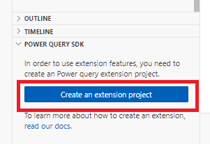
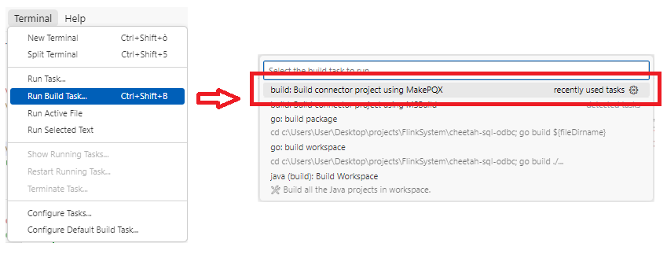

## Connector Download

The Power BI connector is available to download from the automated CI workflow: [link](https://github.com/opensearch-project/sql-odbc/actions/workflows/bi-connectors.yml).
The release snapshots are also available here: [OpenSearch Project](OpenSearchProject.mez) and [Amazon OpenSearch Service](AmazonOpenSearchService.mez).

## Connector Development

The development of the connector is related to the PoweQuery SDK for [VisualStudio](https://marketplace.visualstudio.com/items?itemName=Dakahn.PowerQuerySDK) or for Visual Studio Code from the `Extensions` left tab. 

Is possible to initialize a project for example in VSC with 

The main logic is in `.pq` file (not `.query.pq`) and is not possible to have multiple files of this extension. In connector development there are limitation to the functionalities that is possibile to use as the [data source functions](https://learn.microsoft.com/en-us/power-query/handling-data-access#data-source-functions). The reference and guides of [Power Query M](https://learn.microsoft.com/en-us/powerquery-m/) is available.

After created the program it is required to run compiling and packaging phases as . 

The output `.mez` file will appear in `bin\AnyCPU\Debug` of the same folder.

## Connector Install

1. Put connector `mez` file into: `C:\Users\%USERNAME%\Documents\Power BI Desktop\Custom Connectors`.
2. Install OpenSearch `ODBC` [driver](../../README.md#Download-and-Installation-the-Driver).
3. Run `Power BI Desktop`.
4. Check under `File | Options and settings | Options | Security | Data Extensions` option `(Not Recommended) Allow any extension to load without validation or warning in Power BI Desktop`:

5. Restart `Power BI Desktop`.

## See also

* [Changelog](CHANGELOG.md)
* Installation instructions for
  * [OpenSearch Project connector](OpenSearchProject.md)
  * [Amazon OpenSearch Service connector](AmazonOpenSearchService.md)
* Connector user manual for
  * [Power BI Service](power_bi_service_support.md)
  * [Power BI Desktop](power_bi_support.md)
