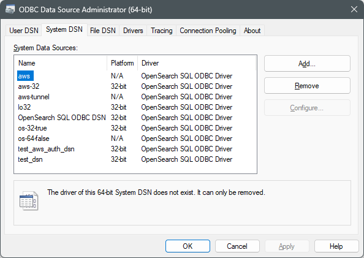
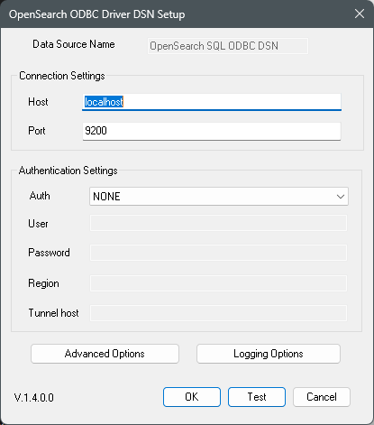
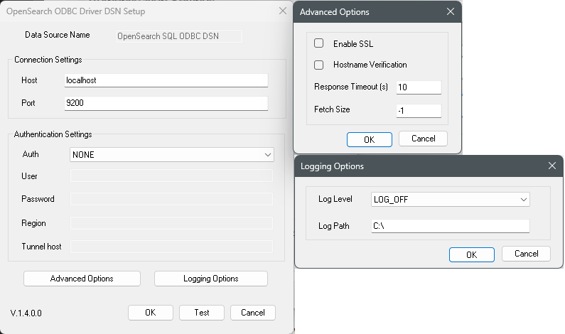

# Configuring a DSN on Windows

## Test Default Connection

1. Open ODBC Data Source Administrator.

 

**NOTE**: Use 32 bit application to configure 32 bit driver and 64 bit app for 64 bit driver.

2. Click on the `System DSN` tab. Select `OpenSearch SQL ODBC DSN` and click on `Configure`.

 

3. DSN Setup window will open with default values for [configuration options](./configuration_options.md).

 

4. Change values of configuration options accordingly.

For example, if you can connect to server using following curl command

 `curl -XGET https://localhost:9200 -u admin:admin`.

 The DSN configuration options can be set as shown below

 

> **NOTE**: For encrypted connection, the `Host` needs to be prefaced with `https://` and `Enable SSL` in Advanced Options should be checked.

5. Click on `Test` to verify connectivity. You will get a message as `Connection successful`.

 

6. Click on `OK` to save DSN values.
