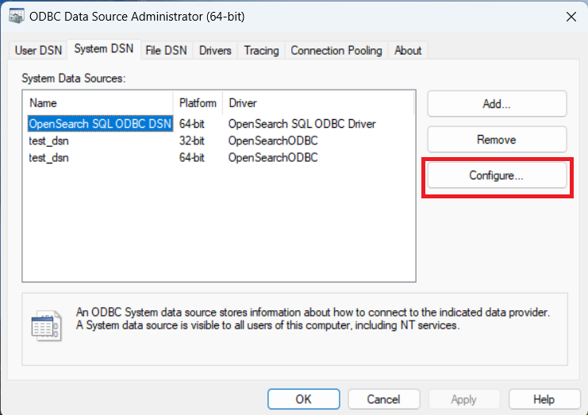
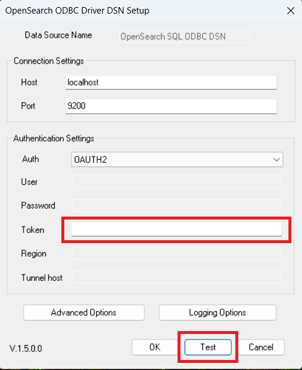

# Test the Oauth2 connection on Windows

## Test Default Connection

1. Open ODBC Data Source Administrator.

 

**NOTE**: Use 32 bit application to configure 32 bit driver and 64 bit app for 64 bit driver.

2. Select the OpenSearch driver and click on the **Configure...** tab.

 

3. Change values of configuration options accordingly, then select `OAUTH2` and insert the token.

 

4. Click on `Test` to verify connectivity. You will get a message as `Connection successful`.

 

